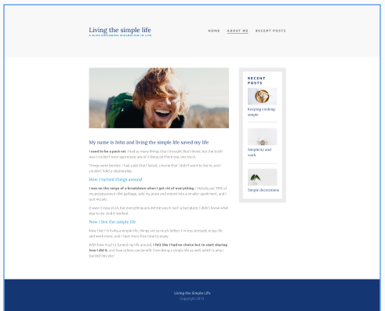
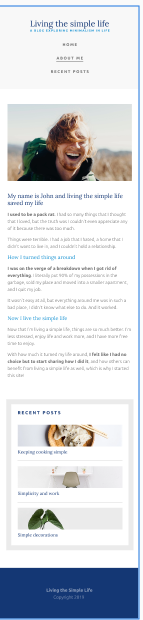
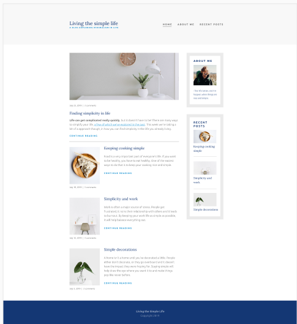
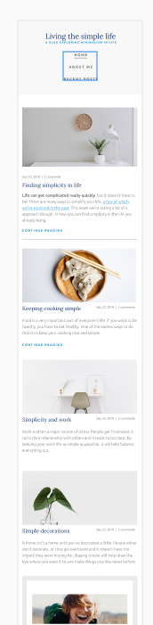
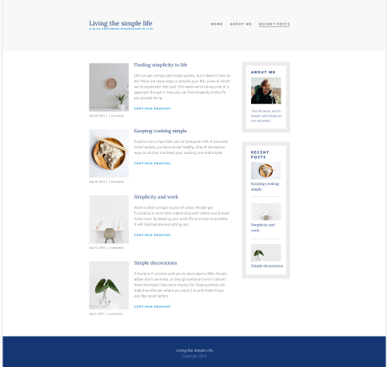
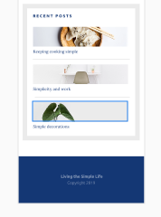

# Living the simple life -- A project.

> This is a project built for understanding responsiveness. It is based on the [Following Design](https://xd.adobe.com/spec/75d448ea-569a-4b7e-721b-9bbd3b2b97b9-03e5/grid)

## About me design
> 
> 

## Home page design
> 
>

## Recent posts design
> 
>      **Mobile version of this is included into the about me section.**

